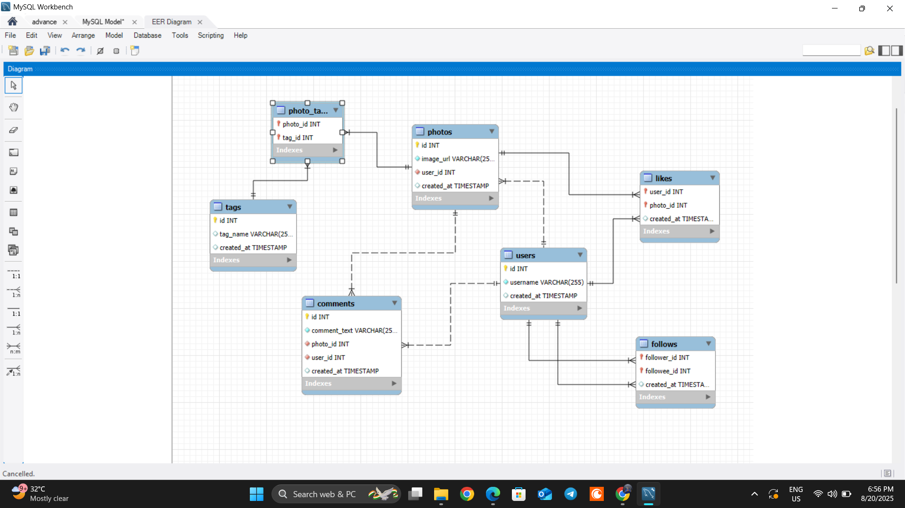

# 📸 Instagram Clone Database Analysis

This project is a **mini Instagram clone database** built using **MySQL**.  
It demonstrates core social media features such as users, photos, likes, comments, follows, and hashtags.  
The database is designed to answer analytical queries that provide insights into user engagement and activity.

---

## 📊 ER Diagram
Below is the **Entity Relationship (ER) Diagram** of the project:



---

## ⚙️ Tech Stack
- **Database**: MySQL  
- **Tool**: MySQL Workbench  
- **Language**: SQL (DDL & DML)  

---

## 🗂️ Database Schema

The database contains the following tables:

- **users** → Stores user information  
- **photos** → Contains uploaded photos  
- **comments** → Stores comments on photos  
- **likes** → Records which users liked which photos  
- **follows** → Manages follower–following relationships  
- **tags** → Hashtag data  
- **photo_tags** → Junction table for tagging photos  

---

## 📥 Dataset

The dataset (`ig_clone_data.sql`) contains **100+ users** with their photos, likes, follows, comments, and hashtags.  
It provides enough volume to perform meaningful queries and analytics.

---

## 🚀 Setup Instructions

1. Clone this repository or download the project files.
2. Open MySQL Workbench.
3. Run the script to create and populate the database:
   ```sql
   SOURCE ig_clone_data.sql;
